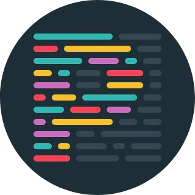

Hi there, Glad to have you here 👋
==================================
I'm a steady learner to be a Software Engineer👨‍💻   
Hope to be responsible for Front-End Position!

<Strong style="font-style:italic">✏️ Language</Strong>   

<Strong>🌘 Client-Side</Strong>
 

<Strong>🌘 Server-Side</Strong>
 

<Strong>🔧 Tools</Strong>
 

 
 
<Strong>Projects</Strong>

Team  
  <ul>
    <li>
    Royal Diary: https://royaldiary.ml/
    </li>
    <li>
    Home Made: https://homemade21.cf/
    </li>
  </ul>
Personal    
 
 
<ul>
  <li>
  To Do List: https://jaykim88.github.io/Vanilla_JS/
  </li>
  <li>
  Kakao Clone: https://jaykim88.github.io/Kakao-Clone2-Completed/
  </li>
  <li>
  Stars Dance Party: https://jaykim88.github.io/new-subClass-dance-party/
  </li>
  <li>
  J Cafe: https://bit.ly/3tPhSjn (PPT)
  </li>
  <li>
  Calculator: https://jaykim88.github.io/new-calculator/
  </li>
  <li>
  Tree UI: https://jaykim88.github.io/new-Tree-UI/
  </li>
</ul>
<Strong>How to reach me? :)</Strong>
 
 
<ul>
  <li>
  Welcome to my Tech-Blog: https://nomadkim880901.tistory.com
  </li>
  <li>
  Email: <a href="mailto:mearak43@gmail.com">mearak43@gmail.com</a>
  </li>
</ul>
<!--
**JayKim88/JayKim88** is a ✨ _special_ ✨ repository because its `README.md` (this file) appears on your GitHub profile.

Here are some ideas to get you started:

- 🔭 I’m currently working on ...
- 🌱 I’m currently learning ...
- 👯 I’m looking to collaborate on ...
- 🤔 I’m looking for help with ...
- 💬 Ask me about ...
- 📫 How to reach me: ...
- 😄 Pronouns: ...
- ⚡ Fun fact: ...
-->
